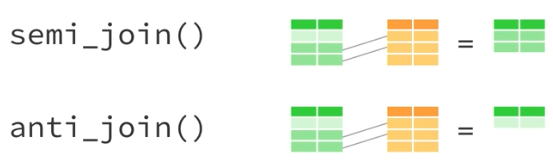

# Data Wrangling

We will mostly be using the `tidyr` and `dplyr` packages for wrangling. With those packages, most wrangling is done with 6 "data verbs." These are `select()`, `mutate()`, `filter()`, `arrange()`, `group_by()`, and `summarise()`. One quick note: summarise can be spelled the British or American way (as can any word with dual spellings). Much of the software was developed by people in New Zealand, hence the British spellings. I learned with British spellings so that's what I use, but it works either way. 

```{r echo = FALSE}
knitr::include_graphics("https://raw.githubusercontent.com/allisonhorst/stats-illustrations/master/rstats-artwork/dplyr_wrangling.png")
```


We can divide our verbs into 3 categories: row verbs, column verbs, and aggregate verbs. 

All of the verbs work in a similar way. The general structure is `verb(data, action)`.

## Row verbs

The two row verbs are `filter()` and `arrange()`. Filter works by taking out rows that we don't want in our data. Arrange works by ordering the rows in some way. We will talk about filter first.

### Filter

Filter takes in boolean statements and returns only the `TRUE` ones. For example, `>`, `<`, and `==` are boolean statements. The double equal is R's way of saying something "is equivalent to."

Let's start by creating a dataframe of only Saturday trips.

```{r}
# create a new dataframe called weekend_trips

saturday_trips <- filter(nice_ride_2018, start_day == "Sat") 

dim(saturday_trips) # check that you have these dimensions
```

We can also make a dataframe of trips that ended after 12 noon.

```{r}
after_12 <- filter(nice_ride_2018, end_hour > 12) 

dim(after_12)
```

Let's say we want some combination of filters. Maybe we want only the Saturday trips that ended after noon? We will use the `&` operator in between filter actions.

```{r}
saturday_after_12 <- filter(nice_ride_2018, end_hour > 12 & start_day == "Sat")

dim(saturday_after_12)
```

Now let's make a dataframe of all the trips on a weekend day. We will use the `|` (or) operator in between filter actions. 

```{r}
weekend_trips <- filter(nice_ride_2018, start_day == "Sat" | start_day == "Sun")

dim(weekend_trips)
```

Let's add Friday to that list.

```{r}
weekendFri_trips <- filter(nice_ride_2018, start_day == "Sat" | start_day == "Sun" | start_day == "Fri")

dim(weekendFri_trips)
```

It gets a little long to write that all out, and this is a pretty simply query. Luckily, R has an `%in%` operator to filter "in bulk."

We would get the same results as above by writing:

```{r}
weekendFri_trips <- filter(nice_ride_2018, start_day %in% c("Sat", "Sun", "Fri"))

dim(weekendFri_trips)
```

### Arrange

Arrange is a way to order your dataset by specific variables. 

You can order by just one variable, like duration. 


## Practice

1. How many trips were more than 30 minutes long? This is equivalent to 1800 seconds. 

2 (a). How many casual trips were there on Wednesdays, Thursdays, and Fridays?

2 (b) . How many casual trips were there on Wednesdays, Thursdays, and Fridays that were 15 minutes or less?

3. How many dockless trips taken by subscribed users were there total? 

## Column verbs

Now that we've talked about wrangling the rows, we can think about wrangling the columns. `mutate` is used to create new columns, while `select` is used to narrow down the columns you keep in your table. 

### Mutate

```{r echo = FALSE, caption = "Artwork by Allison Horst"}
knitr::include_graphics("images/dplyr_mutate.png")
```

Let's say we want to create a new duration variable that is in minutes instead of seconds. We can divide our old column by 60 to create the new column.

```{r}
nice_ride_2018 <- mutate(nice_ride_2018, tripduration_min = tripduration / 60)

head(nice_ride_2018$tripduration_min)
```

## Practice

The average trip duration in minutes is 21.257 (see code below).

```{r}
summary(nice_ride_2018$tripduration_min)
```

Create a new variation called duration_deviation that calculates how far each trip was from the mean. Your resulting column should look something like this...

```{r echo = FALSE}
nice_ride_2018 %>%
  mutate(duration_deviation = tripduration_min - 21.257) %>%
  select(duration_deviation) %>%
  head()
```

### Select

```{r echo = FALSE}
knitr::include_graphics("https://swcarpentry.github.io/r-novice-gapminder/fig/13-dplyr-fig1.png")
```


## Aggregate verbs

### `%>%`

group_by and summarise are the two main verbs for aggregate statistics, they're similar to Excel pivot tables. In this section we will also talk about the pipe, `%>%`, operator. When doing data wrangling tasks there are often many intermediate tables. Maybe you filter, then create a new column, then calculate some summary statistic. Instead of doing all of these as discrete steps, we can link them to push the data through a workflow instead of stopping along the way. This makes life easier for you because you won't clutter your environment or have to remember what `data3` has that `data4` doesn't. 

The way it works is fairly straightforward. You use the `%>%` between data verbs and don't input a new dataset. The operator is telling your verb to use the previously created data.

For example: if you wanted to filter out just Saturday trips and then convert the duration to minutes, you could do:

```{r}
saturday <- filter(nice_ride_2018, start_day == "Sat") %>%
  mutate(duration_minutes = tripduration / 60)
```

Which gives you the exact same output as:

```{r}
saturday <- filter(nice_ride_2018, start_day == "Sat")
saturday <- mutate(saturday, duration_minutes = tripduration / 60)
```

With a lot less effort. 

### group_by & summarise

`group_by` is how we specify the base unit for aggregate summaries and `summarise` tells us what to calculate.

We can count the number of trips at each start station. Here we will group by the start station because we want counts **per** start station. Then to get a count summary we will use the `n()` function, which counts the number of observations or rows per group.

```{r}
trips_per_station <- nice_ride_2018 %>%
  group_by(start_station_name) %>%
  summarise(trips = n())

head(trips_per_station)
```

We can also use functions like `sum()`, `mean()`, `min()`, `median()`, etc. For example, we can calculate the mean trip duration per start station.

```{r}
mean_duration <- nice_ride_2018 %>%
  group_by(start_station_name) %>%
  summarise(mean_duration = mean(tripduration))

head(mean_duration)
```

Then we could also chain a mutate to convert these times to minutes.

```{r}
mean_duration <- nice_ride_2018 %>%
  group_by(start_station_name) %>%
  summarise(mean_duration = mean(tripduration)) %>%
  mutate(mean_duration_min = mean_duration / 60)

head(mean_duration)
```


## Practice

1. Calculate the number of trips for each user type that occurred at each start station. The structure should look like the example below:

Hint: you can use multiple grouping variables

```{r echo = FALSE}
nice_ride_2018 %>%
  group_by(start_station_name, usertype) %>%
  summarise(trips = n()) %>%
  head()
```


## Reshaping verbs

### Spread

```{r echo = FALSE}
knitr::include_graphics("https://garrettgman.github.io/images/tidy-8.png")
```


### Gather

```{r echo = FALSE}
knitr::include_graphics("https://garrettgman.github.io/images/tidy-9.png")
```

## Practice

## Joins

`dplyr` has two different families of joins. First, there's "joining" joins, which is how we typically think of them

```{r echo = FALSE}
knitr::include_graphics("images/joins1.png")
```

Then there's also filtering joins.

```{r echo = FALSE}

```

These are useful when you want to filter the rows of one dataset based on another, but you don't care about the attributes of that second dataset.

The general structure for joins is `join(x, y, c("common variable in x" = "common variable in y"))`. We can join our trips data to the station locations which includes the total number of docks for each station.

First, load the station data.

```{r}
data("station_locations")

head(station_locations)
```

So then if we want to join these by the `start_station_name` variable in our trips dataset, we would type:

```{r paged.print=TRUE}
joined <- left_join(nice_ride_2018, station_locations, by = c("start_station_name" = "name"))

glimpse(joined)
```

We can see at the end that there's now a total_docks variable.

## Practice

* Join the trips and stations on the end_station_name variable